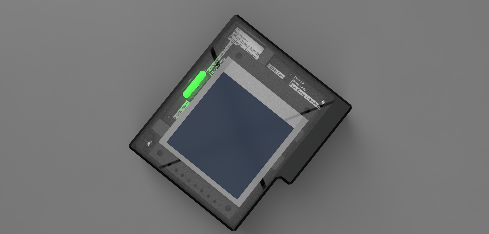
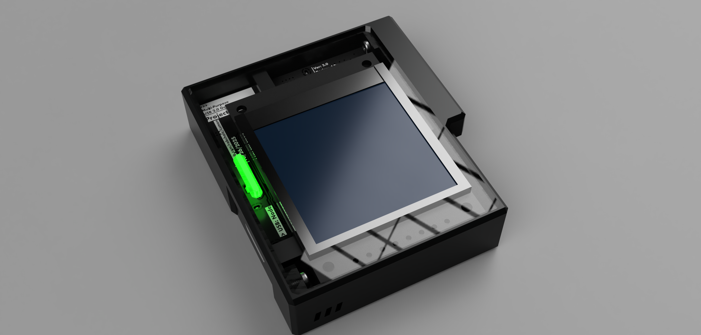

<h1 align="center">Lumen</h1>

<a href="https://github.com/robcholz/Lumen/actions">
<a href="https://github.com/robcholz/Lumen">

     <a href="README.md">English</a> | <a href="README-zh-CN.md">简体中文</a>
  

<i>Like this project? Please consider giving it a Star ⭐️ to help it grow!</i>

---

> A desktop-grade hardware project focused on interaction details,
> for USB-C power monitoring and protection.
>
> Open-sourced from hardware to firmware,
> with a little fun beyond the serious functionality.

> **🔥 Build Lumen FAST on your own.**
>
> No local IDE, no toolchain setup, no need to know SMT soldering.
> Even if you are not familiar with embedded systems or hardware, you can finish it.
>
> 👉 Start here: [Quick Start](docs/quick-start.md)

## What is Lumen?

Lumen is a desktop USB-C power monitoring and protection device,
made for developers and also friendly to non-professional users.

We hope it is not only a debugging tool,
but a device you can keep on your desk for long-term use.

## Why build Lumen?

Many open-source desktop power monitoring projects have these issues:

- Only provide code, missing complete hardware materials, cannot truly reproduce
- Require complex IDEs and toolchains, almost impossible for beginners
- UI stuck at serial print or debug interfaces, hard to use long-term

Lumen's goal is clear:

Let people without embedded or hardware backgrounds
successfully build a USB-C power monitor that is "actually usable and pleasant to use".

For this, Lumen is designed from the beginning around
"reproducibility" and "low barrier",
keeping complexity inside the system rather than pushing it to the user.

## Designed for "Reproducibility"

- No local development environment needed, flash firmware directly via web
- All firmware is built and released by CI, avoiding environment differences
- Hardware, firmware, and UI design are centralized in one repo
- PCB Gerbers, BOM, and 3D enclosure files are fully open-sourced

**You only need to follow the steps to fully reproduce it.**

## Hardware and UI Preview

**USB power monitoring**

**Minecraft easter egg**

**Motion / interaction**

## System Architecture Overview

- System integration: Rust no-std
- UI: Vision-UI
- System: FreeRTOS
- Graphics Driver: u8g2
- Hardware
    - Buzzer
    - INA226
    - LSM6DSO
    - ESP32-C3
    - 240x240 display
    - Rotary encoder
    - Power switch

## Design Notes

### About architecture

- Firmware uses a layered driver structure instead of feature stacking, to speed up development and CI builds.
- UI is independent of top level logic, ensuring interaction changes do not affect core functionality.
- Rust no-std is used only for the system integration layer, not to fully replace C/C++.

### About interaction

- All interactions prioritize "long-term desktop use" rather than debugging convenience.
- UI does not depend on serial output, so the device does not lose value when "detached from the PC".
- Animations and easter eggs are deliberately kept low-frequency to avoid distracting the main function.

### About reproducibility

- All build flows are automated to avoid "author environment" dependency.
- Avoids solutions that require expensive equipment or special tools.
- Explicitly not chasing extreme performance, prioritizing success rate.

### Known limitations

- The web flashing flow depends on browser WebUSB support.
- CI has no cache or diff builds yet, so there is room for speed optimization.

## Further Reading

If you are interested in the UI system used in Lumen,
you may find this article useful:

- [Vision-UI: Designing a Lightweight UI System for Embedded Devices](https://www.robcholz.com/2025/11/16/vision-ui/)

## Project Status

- [x] Hardware v2
- [x] USB-C power monitoring
- [x] Hardware protection logic
- [x] Vision-UI integration
- [x] CI pipeline
- [x] Web quick flashing
- [ ] Documentation still improving

## Contributing

Issues, discussions, and PRs are welcome.
If you are interested in hardware, embedded systems, or UI design, feel free to join.

## License

GPL-3.0
