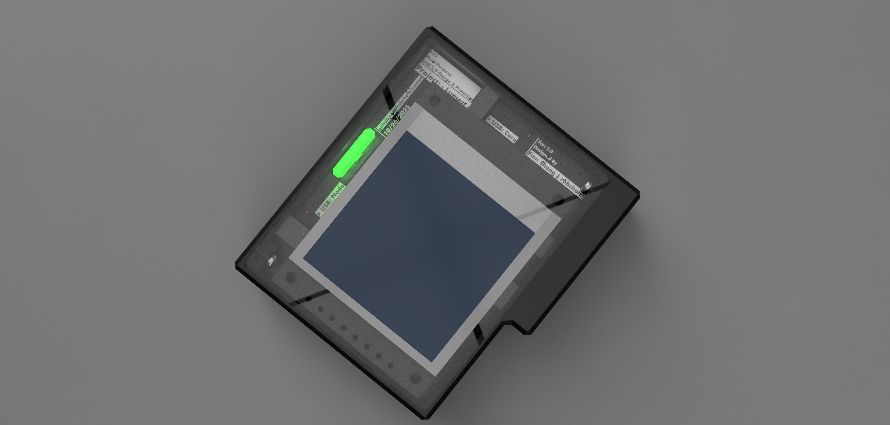
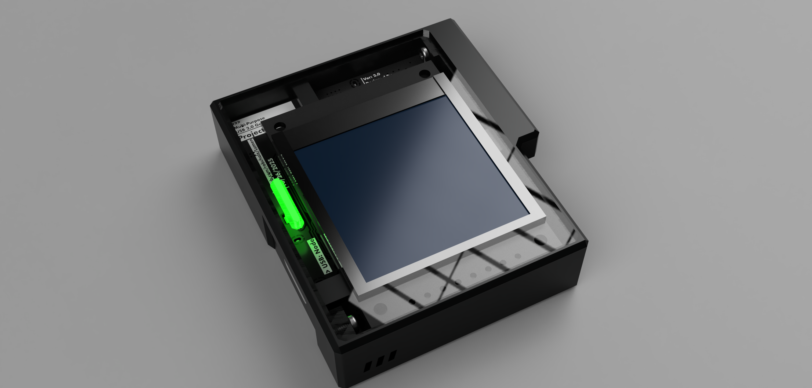

<h1 align="center">Lumen</h1>
<div align="center">

<a href="https://github.com/robcholz/Lumen/actions">
<a href="https://github.com/robcholz/Lumen">
<a href="https://github.com/robcholz/Lumen/blob/main/LICENSE"></a>

<p align="center">
     <a href="README.md">English</a> | <a href="README-zh-CN.md">简体中文</a>
  </p>

<i>Like this project? Please consider giving it a Star ⭐️ to help it grow!</i>

</div>

---

> A desktop hardware node that lets your computer, games, and system states
> physically exist on your desk.
>
> Think of it as a Stream Deck,
> but programmable at the firmware level — and fully open-source.


> **🔥 Build Lumen FAST on your own.**
>
> No local IDE, no toolchain setup, no need to know SMT soldering.
> Even if you are not familiar with embedded systems or hardware, you can finish it.
>
> 👉 Start here: [Quick Start](docs/quick-start.md)

## What is Lumen?

Lumen is a desktop-grade hardware interaction node.
It lives on the desktop long-term, can sense state, participate in interaction,
and present and feed back those changes in hardware.

## Why Lumen?

Lumen is designed to stay on your desk every day,
as a hardware presence that keeps evolving with what you do.

If you enjoy projects that connect software with the physical world,
Lumen is built for you.

## Build your own Lumen in under 10 minutes

- Flash firmware directly from your browser
- No local IDE, no toolchain setup
- All builds are produced by CI
- Hardware files are fully open-sourced

👉 Start here: [Quick Start](docs/quick-start.md)

## What people build with Lumen

- A physical Minecraft status display
- A USB-C power monitor that lives on your desk
- A system state notifier (CPU, build, deploy, errors)
- A programmable interaction gadget for games and tools

Lumen is not a single-purpose device —
it’s a hardware base you can repurpose.

## See it in action

**Minecraft → Physical Device**


When something happens in Minecraft,
your desk reacts in real time — lights, motion, and sound.

## Hardware and UI Preview

**USB power monitoring**


**Motion / interaction**






## System Architecture Overview

- System integration: Rust no-std
- UI: Vision-UI
- System: FreeRTOS
- Graphics Driver: u8g2
- Hardware
    - Buzzer
    - INA226
    - LSM6DSO
    - ESP32-C3
    - 240x240 display
    - Rotary encoder
    - Power Switch

## Design Notes

### About architecture

- Firmware uses a layered driver structure instead of feature stacking, to speed up development and CI builds.
- UI is independent of top level logic, ensuring interaction changes do not affect core functionality.
- Rust no-std is used only for the system integration layer, not to fully replace C/C++.

### About interaction

- All interactions prioritize "long-term desktop use" rather than debugging convenience.
- UI does not depend on serial output, so the device does not lose value when "detached from the PC".
- Animations and easter eggs are deliberately kept low-frequency to avoid distracting the main function.

### About reproducibility

- All build flows are automated to avoid "author environment" dependency.
- Avoids solutions that require expensive equipment or special tools.
- Explicitly not chasing extreme performance, prioritizing success rate.

### Known limitations

- The web flashing flow depends on browser WebUSB support.
- CI has no cache or diff builds yet, so there is room for speed optimization.

## Further Reading

If you are interested in the UI system used in Lumen,
you may find this article useful:

- [Vision-UI: Designing a Lightweight UI System for Embedded Devices](https://www.robcholz.com/2025/11/16/vision-ui/)

## Utility Scripts

The Python helpers under `script/` are managed from the project-root `pyproject.toml`.

Run them from the repository root with `uv`:

```bash
uv run lumen-png-to-rgb565-c --help
uv run lumen-display-skin-payload --help
uv run lumen-serial-pack-send --help
uv run lumen-logo --help
```

If you prefer plain `pip`, `python -m pip install -e .` works as well.

## Project Status

- [x] Hardware v2
- [x] USB-C power monitoring
- [x] Hardware protection logic
- [x] Vision-UI integration
- [x] CI pipeline
- [x] Web quick flashing
- [ ] Documentation still improving

## Contributing

If this project is useful or interesting to you,
consider giving it a ⭐ — it really helps.

Issues, discussions, and PRs are welcome.
If you are interested in hardware, embedded systems, or UI design, feel free to join.

## License

GPL-3.0
